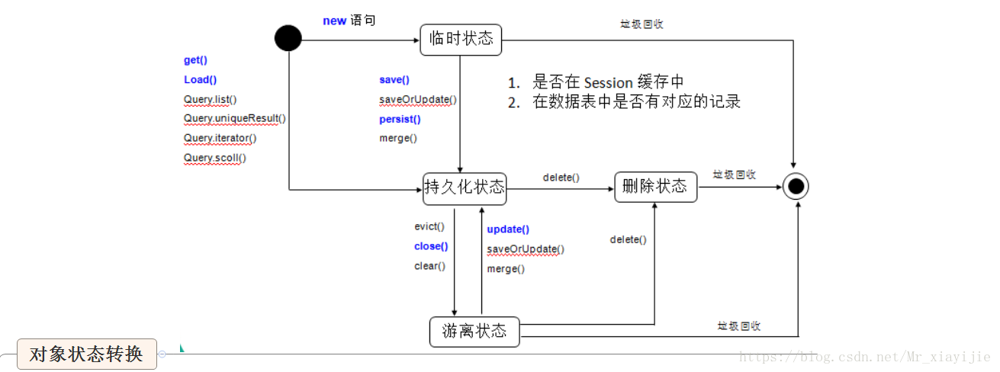
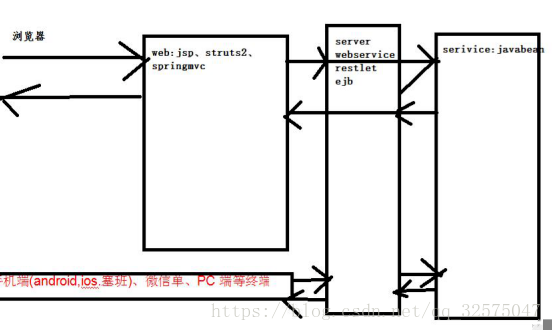

# 框架部分

### 1. 框架的定义

> 框架（Framework）是一个框子——指其约束性，是一个架子——指其支撑性。
>
> 程序中指*为解决一个开放性问题而设计的具有一定约束性的支撑结构。在此结构上可以根据具体问题扩展、安插更多的组成部分，从而可以更迅速和方便的构建完整的解决问题的方案。*

- 框架本身并一般不完整到可以解决特定问题，但是可以帮助快速解决特定问题。
- 框架是为扩展而设计的
- 框架里面可以为后续扩展的组件提供更多辅助性、支撑性的方便易用的使用工具。

### 2. MVC模式

> MVC全名是Model View Controller

> 是模型-视图-控制器的缩写，一种软件设计典范，是一种业务逻辑，数据，界面显示分离的方法组织代码，将业务逻辑聚集到一个部件里，在改进和个性化制定界面及用户交互的同时，不需要重新编写业务逻辑。

最经典的，就是`jsp（view）+servlet（controller）+javabean(model)`

1. 控制器收到来自用户的请求

2. 控制器调用Javabean完成业务

3. 完成业务后通过控制器跳转jsp页面的方式给用户反馈信息

4. jsp给用户做出响应。

控制器是核心


### 3. MVC 框架

#### 3.1 什么是MVC框架？

> 是为了解决传统MVC模式（jsp+servlet+javabean）一些问题而出现的框架。

#### 3.2 传统MVC模式问题

1. 所有的`servlet`和`servlet`映射都要配置在`web.xml`中，如果项目太大，`web.xml`就太庞大，并且不能实现模块化管理。

2. `Servlet`的主要功能就是*接受参数*，*调用逻辑*，*跳转页面*，比如像其他字符编码，文件上传等功能也要写在`servlet`中，不能让`servlet`功能单一。

3. 接受参数比较麻烦,不能通过model接收，只能单个接收，接收完成后转换封装model。

   ```java
   String name= request.getParameter("name");
   User user=new User();
   user.setName(name);
   ```

4.跳转页面方式比较单一（`forward`，`redirect`），并且当我的页面名称发生改变时需要修改`servlet`源代码。

#### 3.3 现在比较常用的`MVC`框架
> `struts2`、`springMVC`

### 4. Struts2的执行流程或原理

#### 4.1 Struts2的原理？


一个请求在struts2框架中的处理部分大概分以下步骤：

1.客户端浏览器发送请求

2.这个请求经过一系列的过滤器（`Filter`）（这些过滤器中有一个叫做`ActionContextCleanUp`的可选过滤器，这个过滤器对于`struts2`和其他框架的集成很有帮助，例如：SiteMeshPlugin）；

3.接着`FilterDispatcher`(`StrutsPreparedAndExecuteFilter`)被调用，`StrutsPreparedAndExecuteFilter`询问`ActionMapper`来决定这个请求是否需要调用某个`Action`；

4.如果`ActionMapper`决定需要调用某个`Action`，`FilterDispatcher`(`StrutsPreparedAndExecuteFilter`)把请求的处理交给`ActionProxy`;

5.`ActionProxy`通过`Configuration Manager`询问框架的配置文件，找到需要调用的`Action`类；

6.`ActionProxy`创建一个`Action Invocation`的实例

7.`ActionInvocation`实例使用命名模式来调用，在调用Action的过程前后，涉及到相关拦截器（`Intercepter`）的调用。

8.一旦`Action`执行完毕，`ActionInvocation`负责根据`struts.xml`中的配置找到对应的返回结果，返回结果通常是（但不总是，也可能是另外的一个`action`链）一个需要被表示的`jsp`或者`FreeMarker`的模版，在表示的过程中可以使用`Struts2`框架中继承的标签。在这个过程中需要涉及到`ActionMapper`。

#### 4.2 Struts2中执行的流程(简化)

1.浏览器发送请求，经过一系列的过滤器后，到达核心过滤器（`StrutsPrepareAndExecuteFilter`）

2.`StrutsPrepareAndExecuteFilter`通过`ActionMapper`判断当前的请求是否需要某个`Action`处理，如果不需要，则走原来的流程，如果需要则把请求交给`ActionProxy`来处理。

3.`ActionProxy`通过`Configuration Manager`询问框架的配置文件（`Struts.xml`），找到需要调用的`Action`类

4.创建一个`ActionInvocation`实例，来调用`Action`的对应方法来获取结果集的`name`，在调用前后会执行相关拦截器。

5.通过结果集的`Name`找到对应的结果集来对浏览器进行响应。


#### 4.3 要点：拦截，判断，寻找，响应


- 参考：[Struts2工作原理以及核心思想](https://blog.csdn.net/u011958281/article/details/74685659)

### 5. struts2的拦截器

#### 5.1 原理

>  Java里的拦截器是动态拦截Action调用的对象，它提供了一种机制可以使开发者能够定义在一个Action执行的前后，执行的代码。可以在一个action执行前阻止其执行，同时也可以提供一种可以提取action中可重用部分的方式。

> 在AOP（Aspect-Oriented Programming）中拦截器用于在某个方法或者字段被访问之前，进行拦截然后在之前或之后加入某些操作。

 

#### 5.2 使用

struts2中的功能（参数处理，文件上传，字符编码等）都是通过系统拦截器实现的。

如果业务需要，我们也可以自定义拦截器，进行可插拔配置，在执行action的方法前后，加入相关逻辑完成业务。

#### 5.3 使用场景：

1. 用户登录判断，在执行action的前面判断是否已经登录，如果没有登录的跳转到登录页面。

2. 用户权限判断，在执行action的前面判断是否具有权限，如果没有权限则给出提示信息。

3. 登录日志。

### 6.springMVC的执行流程


 

 

1. 用户向服务器发送请求，请求被`SpringMVC`的前端控制器`DispatcherServlet`截获。**(捕获)**
2. `DispatcherServlet`对请求的URL（统一资源定位符）进行解析，得到URI(请求资源标识符)，然后根据该URI，调用`HandlerMapping`获得该Handler配置的所有相关的对象，包括`Handler`对象以及`Handler`对象对应的拦截器，这些对象都会被封装到一个`HandlerExecutionChain`对象当中返回。**(查找Handler)**
3. `DispatcherServlet`根据获得的`Handler`，选择一个合适的`HandlerAdapter`。`HandlerAdapter`的设计符合面向对象中的单一职责原则，代码结构清晰，便于维护，最为重要的是，代码的可复制性高。`HandlerAdapter`会被用于处理多种Handler，调用Handler实际处理请求的方法。**(适配Handler)**
4. 提取请求中的模型数据，开始执行`Handler`(`Controller`)。在填充`Handler`的入参过程中，根据配置，spring将帮助做一些额外的工作。**(拦截器)**
   - 消息转换：将请求的消息，如json、xml等数据转换成一个对象，将对象转换为指定的响应信息。
   - 数据转换：对请求消息进行数据转换，如String转换成Integer、Double等。
   - 数据格式化：对请求的消息进行数据格式化，如将字符串转换为格式化数字或格式化日期等。
   - 数据验证：验证数据的有效性如长度、格式等，验证结果存储到`BindingResult`或`Error`中。
5. `Handler`执行完成后，向`DispatcherServlet`返回一个`ModelAndView`对象，`ModelAndView`对象中应该包含视图名或视图模型。**(执行Handler)**
6. 根据返回的`ModelAndView`对象，选择一个合适的`ViewResolver`(视图解析器)返回给`DispatcherServlet`。**(视图解析)**
7. `ViewResolver`结合`Model`和`View`来渲染视图。**(渲染)**
8. 将视图渲染结果返回给客户端。


- 参考：[pring MVC请求处理流程](https://www.cnblogs.com/dreamworlds/p/5396112.html)

### 7. springMVC和struts2的不同

1. 核心控制器不同  springMVC的核心控制器是servlet，struts2是Filter（核心控制器的主要作用是处理所有的请求）

2. 控制器实例，springMVC会比struts2快一些（理论上）。

   springMVC是基于方法设计，而struts2是基于对象。

   struts2每次发送请求都会实例一个action，每个action都会被注入属性，而springMVC更像servlet，只有一个实例，每次执行对应的方法即可。（注意，由于是单例实例，所以应当避免全局变量的修改，这样会产生线程安全问题）

3. 管理方式：大部分公司的核心架构中，会用到spring，而springMVC又是spring中的一个模块，所以spring对于springMVC的控制器管理更加简单方便，而且提供了全注解方式进行管理，各种功能的注解都比较全面，使用简单，而struts2需要采用xml很多的配置参数来管理（虽然也可以采用注解，但几乎没有公司这么做）。

4. 参数传递：Struts2中自身提供多种参数接受，其实都是通过（ValueStack）进行传递和赋值，而springMVC是通过方法的参数进行接收。

5. 学习难度：struts有很多的技术点，比如拦截器，值栈及OMG表达式，学习成本较高，springMVC比较简单，较少的时间就可以上手。

6. Interceptor的实现机制：struts有自己的interceptor机制，springMVC用的是独立的AOP方式。

7. springMVC处理ajax请求，直接通过返回数据，方法中使用注解@ResponseBody，springMVC自动把对象转换为json数据，而struts2是通过插件的方式进行处理。

在springMVC流行起来之前，struts2在MVC框架中占核心地位，随着springMVC的出现，springMVC慢慢的取代struts2，但是很多企业都是原来搭建的框架，使用struts2较多。

### 8. 简单介绍下spring或者spring的两大核心

####8.1 spring是什么？

>  spring是J2EE应用程序框架，是轻量级的IOC和AOP的容器框架（相对于重量级的EJB），主要是针对javabean的生命周期进行管理的轻量级容器，可以单独使用，也可以和struts2框架，ibatis框架等组合使用。

#### 8.2. IOC（Inversion of Control）或DI（Dependency Injection）

- IOC控制反转

  原来：我的service需要调用DAO，Service就需要创建DAO

  Spring：spring发现你的service依赖于dao就给你注入

- 核心原理：就是配置文件+反射（工厂模式也可以）+容器（map）

#### 8.3. OP：面向切面编程

- 核心原理：使用**动态代理**的设计模式在执行方法前后或出现异常加入相关逻辑。

- 我们主要使用AOP来做：

  1. 事务处理：执行方法前，开启事务，执行完成后关闭事务，出现异常后回滚事务

  2. 权限判断：在执行方法前，判断是否具有权限

  3. 日志：在执行前进行日志处理

### 9. spring事务的传播特性和隔离级别

#### 9.1 事务的传播特性

> 多个事务存在是怎么处理的策略
> propagation 传播特性： 例如`PROPAGATION_REQUIRED`

- `required` 需要：如果存在一个事务，则支持当前事务，如果没有则开启。

- `supports` 支持：如果存在一个事务，支持当前事务，如果没有事务，则非事务的执行

- `mandatory` 必要的：如果已经存在一个事务，支持当前事务，如果没有一个活动的事务，则抛出异常

- `required_new`:总是开启一个新的事务，如果一个事务已经存在，则将这个存在的事务挂起。

- `not_support`:总是非事务的执行，并挂起任何存在的事务。

- `never` 绝不:总是非事务地执行，如果存在一个活动事务，则抛出异常

- `nested` 嵌套的：如果有就嵌套，没有就开启事务。

#### 9.2 事务的隔离级别

- `DEFAULT` 这是一个`PlatfromTransactionManager`默认的隔离级别，使用数据库默认的事务隔离级别。
  - Mysql 默认:可重复读 
  - Oracle 默认:读已提交
- 未提交读（`read uncommited`） :是最低的事务隔离级别，它允许另外一个事务可以看到这个事务未提交的数据。 
  - 脏读，不可重复读，虚读都有可能发生。
- 已提交读 （`read commited`）:保证一个事物提交后才能被另外一个事务读取。另外一个事务不能读取该事物未提交的数据。 
  - 避免脏读。但是不可重复读和虚读有可能发生。
- 可重复读 （`repeatable read`） :这种事务隔离级别可以防止脏读，不可重复读。但是可能会出现幻象读。它除了保证一个事务不能被另外一个事务读取未提交的数据之外还避免了以下情况产生（不可重复读）。 
  - 避免脏读和不可重复读.但是虚读有可能发生。
- 串行化的 （`serializable`） :这是花费最高代价但最可靠的事务隔离级别。事务被处理为顺序执行。除了防止脏读，不可重复读之外，还避免了幻象读（避免三种）
  - 避免以上所有读问题。
#### 9.3 事务的并发问题
1. 脏读：事务A读取了事务B更新的数据，然后B回滚操作，那么A读取到的数据是脏数据。

2. 不可重复读：事务 A 多次读取同一数据，事务 B 在事务A多次读取的过程中，对数据作了更新并提交，导致事务A多次读取同一数据时，结果 不一致。

3. 幻读：系统管理员A将数据库中所有学生的成绩从具体分数改为ABCDE等级，但是系统管理员B就在这个时候插入了一条具体分数的记录，当系统管理员A改结束后发现还有一条记录没有改过来，就好像发生了幻觉一样，这就叫幻读。

小结：不可重复读的和幻读很容易混淆，不可重复读侧重于修改，幻读侧重于新增或删除。解决不可重复读的问题只需锁住满足条件的行，解决幻读需要锁表

### 10. ORM框架

> **对象关系映射**（Object Relational Mapping,简称ORM）模式是一种为了解决面向对象与关系数据库存在的互不匹配的现象的技术。
>
> 简单地说，ORM是通过使用描述对象和数据库之间映射的元数据，将程序中的对象自动持久到关系数据库中。

那么，到底如何实现持久化呢？
- 一种简单的方案是采用硬编码方式（jdbc操作sql方式），为每一种可能的数据库访问操作提供单独的方法
  > 这种方案存在以下不足：
  > 1.持久化层缺乏弹性，一旦出现业务需求的变更，就必须修改持久层的接口。
  > 2.持久化层同时与域模型与关系数据库模型绑定，不管域模型还是关系数据库模型发生变化，都要修改持久化层的相关程序代码，增加了软件的维护难度。

- ORM提供了实现持久化层的另一种模式。
  > 它采用映射元数据来描述对象关系的映射，使得ORM中间件能在任何一个应用的业务逻辑层和数据库层之间充当桥梁。
  > Java典型的ORM框架有：hibernate，mybatis，speedframework。

  > ORM框架：为了解决解决面对对象与关系型数据库存在的互不匹配的现象的框架

 

- ORM的方法论基于三个核心原则：

    简单：以最基本的形式建模数据。

    传达性：数据库结构被任何人都理解的语言文档化.

    精确性：基于数据模型创建正确标准化了的结构。

### 11.ibatis（mybatis）和hibernate有什么不同？
#### 11.1 相同点：
都是Java中ORM框架，屏蔽jdbc，api的底层访问细节，我们不用与jdbc api打交道就可以完成对数据库的持久化操作。jdbc api编程流程固定，还将sql语句与Java代码混杂在了一起，经常需要拼凑sql语句，细节很繁琐。

- ibatis(mybatis)的好处：
    >屏蔽jdbc api的底层访问细节，将sql语句与Java代码进行分离，提供了将结果集自动封装成为实体对象和对象的集合的功能。queryforList返回对象集合，用queryforObject返回单个对象；提供了自动将实体对象的属性传递给sql语句的参数。

- hibernate的好处：
    > hibernate是一个全自动的ORM映射工具，它可以自动生存sql语句，并执行并返回Java结果。

#### 11.2 不同点：
1. hibernate要比ibatis（mybatis）功能强大很多，因为hibernate自动生存sql语句。
2. ibatis（mybatis）需要我们自己在xml配置文件中写sql语句，可以处理复杂的SQL语句，而hibernate不能。
   hibernate我们无法直接控制该语句，我们就无法去写特定的高效的sql，对于一些不太复杂的sql查询，hibernate可以很好地帮我们完成，但是，对于复杂的查询，hibernate就很难适应了，这时候用ibatis就是不错的选择，因为ibatis还是由我们自己写sql语句。
3. ibatis要比hibernate简单得多，ibatis是面向sql的，不用考虑对象间一些复杂的映射关系。

### 12. hibernate映射对象状态及其转换
- 瞬时状态（transient）：刚用new语句创建，没有被持久化
- 持久化状态（persistent）：已经被持久化，加入session的缓存中，session是没有关闭该状态的对象为持久化对象。
- 游离状态：已经被持久化，但是不处于session中。该状态的对象为游离对象。
- 删除状态：对象有关联的ID，并且在session管理下，但是已经被计划（事务提交的时候，commit（））删除，如果没有事务就不能被删除。

对象状态的转换：

 
- 参考：[Hibernate对象状态转换](https://blog.csdn.net/Mr_xiayijie/article/details/82461773)

### 13. hibernate的缓存
#### 13.1 为什么使用缓存？
> 为了提高访问速度，把磁盘或数据库访问变成内存访问。
 
#### 13.2 hibernate的缓存原理是怎样的？
分两种：
hibernate一级缓存和hibernate二级缓存。

##### 13.2.1 hibernate一级缓存又被称为"session的缓存"。
> session缓存内置不能被卸载，session的缓存是事务范围的缓存（session对象的生命周期通常对应一个数据库事务或者一个应用事务）。
一级缓存中，持久化类的每一个实例都具有唯一地OID。
##### 13.2.2 hibernate二级缓存又称为"sessionFactory的缓存"。
> 由于sessionFactory对象的生命周期和应用程序的整个过程对应，**从应用启动到应用结束有效**,因此hibernate二级缓存是进程范围或者集群范围的缓存，有可能出现并发问题，因此需要采用适当的并发访问策略，该策略为被缓存的数据提供了事务隔离级别。

二级缓存是可选的，是一个可配置的插件，默认下sessionFactory不会启用这个插件。
hibernate提供了`org.hibernate.cache.CacheProvider`接口，它充当缓存插件与hibernate之间的适配器。需要手动开启。


#### 13.3 什么样的数据适合放在二级缓存中？
>**缓存**：保存数据库后，在内存中保存一份，如果更新了数据库就要同步更新。
1. 很少被修改的数据    发帖的最后回复时间
2. 经常被查询的数据    电商的地点
3. 不是很重要的数据，允许出现偶尔并发的数据
4. 不会被并发访问的数据
5. 常量数据

#### 13.4 扩展：
hibernate的二级缓存默认是不支持分布式缓存的。使用memcache,redis等中央缓存来代替二级缓存。


### 14. webservice的使用场景
> webservice是一个SOA（面向服务的编程）的架构，它是不依赖于语言，不依赖于平台，可以实现不同的语言间的相互调用，通过internet进行基于http协议的网络应用间的交互。


- 使用场景：
1. 异构系统（不同语言）的整合
2. 不同客户端的整合 浏览器，手机端（Android，iOS，塞班），微信端，pc端等终端来访问。
- 实际例子：
  - 天气预报：可以通过实现webservice客户端调用远程天气服务来实现。
  - 单点登录：一个服务是所有系统的登录。

### 15. activiti的简单介绍
> Activiti是一个业务流程管理（BPM）和工作流系统，适用于开发人员和系统管理员。其核心是超快速，稳定的BPMN2流程引擎，它易于与spring集成使用。

主要是用在OA中，把线下流程放到线上，把现实生活中一些流程固化定义到系统中，然后通过输入表单数据完成业务。

它可以用在OA系统的流程管理中：
请假流程  小于三天一级主管审批，大于三天二级才能审批
报销流程   >1W找谁,>2W找谁,>3W找谁。
