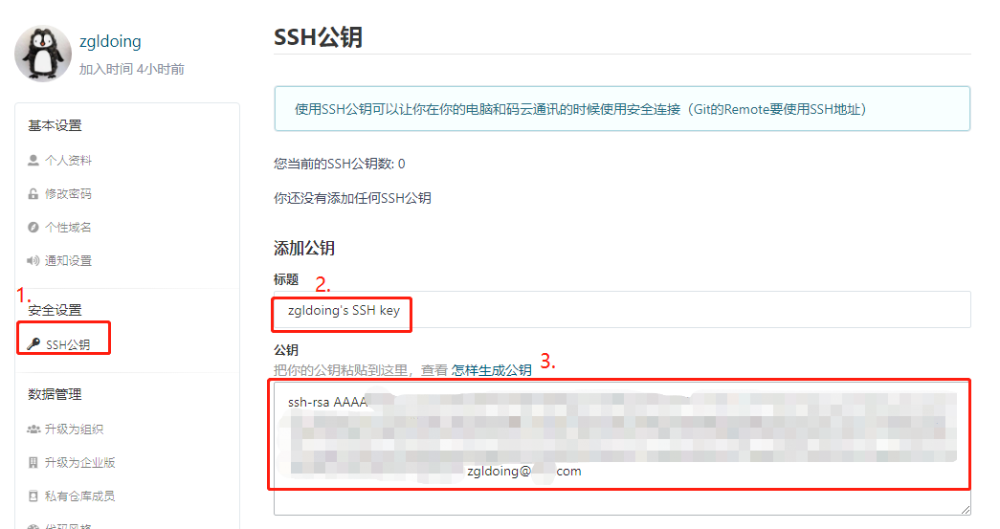

### 码云（Gitee），GitHub 配置SSH说明


## 简介

GitHub和码云均基于Git，所以两者的操作方法基本一致。

GitHub与码云均提供免费的代码仓库。

GitHub免费版只能创建公开的项目，私有项目需要付费。

码云免费版支持5人以下的组织，可以**创建私有项目**。

不过使用GitHub时，国内的用户经常遇到的问题是访问速度太慢，有时候还会出现无法连接的情况，可酌情考虑。

 码云：<https://gitee.com/>

GitHub：<https://github.com>

### 安装使用

#### 1. [安装Git](git使安装与使用.md)且注册账号GitHub或Gitee账号

#### 2. 获取SSHKey

首先要在本地创建一个ssh key ,目的就是你现在需要在你电脑上获得一个密匙。

按如下命令来生成sshkey:

```bash
$ ssh-keygen -t rsa -C "youremail@youremail.com"  

# Generating public/private rsa key pair...
# 三次回车即可生成 ssh key
```

 查看 public key，

```bash
$ cat ~/.ssh/id_rsa.pub
# ssh-rsa AAAAB3NzaC1yc2E... youremail@youremail.com
```

#### 3. 上传自己的SSH公钥

把生成的SSH公钥在右上角用户头像 -> 菜单“修改资料”，然后选择“SSH公钥”添加到Gitee（gitee.com [SSHKey添加地址](http://git.oschina.net/profile/sshkeys)）或GitHub（github.com [SSHKey添加地址](https://github.com/settings/ssh/new)）



添加后，在git bash终端中输入

```bash
#Gitee
$ ssh -T git@gitee.com

#GitHub
$ ssh -T git@github.com
```

第一次绑定的时候输入上边的代码之后会提示是否continue,输入yes后程序会自动连接，如果要求登录，直接输入登录信息即可。

再次执行上面的命令，检查是否成功连接，如果返回一下信息，则表示添加成功

```bash
$ ssh -T git@gitee.com
Hi zgldoing! You've successfully authenticated, but GITEE.COM does not provide shell access.

```


#### 4. 设置基本信息(安装Git时已设置可忽略)

 接下来还需要简单的设置一些东西。

```
$ git config --global user.name "yourname"
$ git config --global user.email "youremail@youremail.com"
```

 name尽量和码云或GitHub保持一致，但email必须是码云或GitHub注册时使用的邮箱。命令不分前后，没有顺序。

#### 5. 初始化本地库

然后就是将你的远程仓库克隆到本地，或者你可以在本地初始化一个项目后再进行云端绑定。

##### 5.1  远程仓库克隆到本地

```bash
#Gitee
$ git clone https://gitee.com/yourname/repository

#Github
$ git clone https://github.com/yourname/repository.git

#yourname  您在码云或github注册的用户名
#repository  您创建的远程仓库名称
```

##### 5.2 本地初始化

```bash
#Gitee
$ cd d:/test //首先在文件系统中创建一个项目文件夹，然后在Git中 cd 到这个工程目录
$ git init //初始化本地项目
$ git remote add origin <远程仓库地址> //绑定远程仓库
#注:地址形式为 https://gitee.com/yourname/test.git 或 git@gitee.com:yourname/test.git

#Github
$ cd d:/test
$ git init
$ git remote add origin <远程仓库地址>
#注：地址形式为 https://github.com/yourname/test.git
```
##### 5.3 关联远程仓库说明

https和SSH两种地址方式都行，鉴于之前GitHub使用的是https方式本次使用SSH方式。

本地库上使用命令`git remote add`把它和码云的远程库关联：

```bash
$ git remote add origin git@gitee.com:zgldoing/DoingGit.git
```

之后，就可以正常地用`git push`和`git pull`推送了！

如果在使用命令`git remote add`时报错：

```bash
git remote add origin git@gitee.com:zgldoing/DoingGit.git
fatal: remote origin already exists.
```

这说明本地库已经关联了一个名叫`origin`的远程库，此时，可以先用`git remote -v`查看远程库信息：

```bash
$ git remote -v
origin  https://github.com/zgldoing/DoingGit.git (fetch)
origin  https://github.com/zgldoing/DoingGit.git (push)
```

可以看到，本地库已经关联了`origin`的远程库，并且，该远程库指向GitHub。

我们可以删除已有的GitHub远程库：

```bash
$ git remote rm origin
```

再关联码云的远程库（注意路径中需要填写正确的用户名）：

```bash
$ git remote add origin git@gitee.com:zgldoing/DoingGit.git
```

此时，我们再查看远程库信息：

```bash
$ git remote -v
origin    git@gitee.com:zgldoing/DoingGit.git (fetch)
origin    git@gitee.com:zgldoing/DoingGit.git (push)
```

现在可以看到，origin已经被关联到码云的远程库了。通过`git push`命令就可以把本地库推送到Gitee上。

### 6. 配置多个远程库

一个本地库能不能既关联GitHub，又关联码云呢？

答案是肯定的，因为git本身是分布式版本控制系统，可以同步到另外一个远程库，当然也可以同步到另外两个远程库。

使用多个远程库时，我们要注意，git给远程库起的默认名称是`origin`，如果有多个远程库，我们需要用不同的名称来标识不同的远程库。

仍然以`DoingGit`本地库为例，我们先删除已关联的名为`origin`的远程库：

```bash
$ git remote rm origin
```

然后，先关联GitHub的远程库：

```bash
$ git remote add github https://github.com/zgldoing/DoingGit.git
```

注意，远程库的名称叫`github`，不叫`origin`了。

接着，再关联码云的远程库：

```bash
$ git remote add gitee git@gitee.com:zgldoing/DoingGit.git
```

同样注意，远程库的名称叫`gitee`，不叫`origin`。

现在，我们用`git remote -v`查看远程库信息，可以看到两个远程库：

```bash
$ git remote -v
$ gitee    git@gitee.com:liaoxuefeng/learngit.git (fetch)
$ gitee    git@gitee.com:liaoxuefeng/learngit.git (push)
$ github    git@github.com:michaelliao/learngit.git (fetch)
$ github    git@github.com:michaelliao/learngit.git (push)
```

如果要推送到GitHub，使用命令：

```bash
$ git push github master
```

如果要推送到码云，使用命令：

```bash
$ git push gitee master
```

这样一来，我们的本地库就可以同时与多个远程库互相同步：

```ascii
┌─────────┐ ┌─────────┐
│ GitHub  │ │  Gitee  │
└─────────┘ └─────────┘
     ▲           ▲
     └─────┬─────┘
           │
    ┌─────────────┐
    │ Local Repo  │
    └─────────────┘
```

码云与GitHub一样提供了Pull request功能。


### 7. 更新到远程仓库

在本地进行编辑后，更新到远程仓库

```bash
$ git add .    //指定更新内容    . 表示全部更新，test.txt 表示更新指定文件
$ git commit -m "一些注释说明"     //添加更新说明
$ git push github master            //执行更新操作
```
### 8. 从GitHub导入仓库到Gitee
Gitee上可以从GitHub导入仓库，导入后可以在本地原来的项目基础上（本地与GitHub上次push一致）直接push上传。
同时执行以下命令即可，同时上传到GitHub和Gitee
```bash
$ git push github master
$ git push gitee master
```

### 8. 从远程仓库同步最新版本到本地

```bash
$ cd d:/test
$ git pull github master
```

清屏

```bash
$ clear
```


---

## 参考

[廖雪峰的Git教程](https://www.liaoxuefeng.com/wiki/0013739516305929606dd18361248578c67b8067c8c017b000)

[入门级 - 码云（Gitee），GitHub 教程](https://www.cnblogs.com/flish/p/9129964.html)