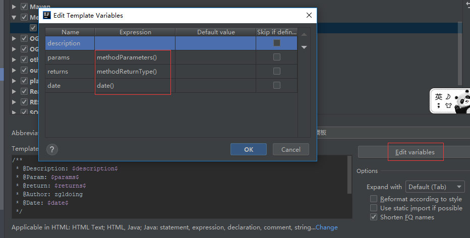

# IntelliJ IDEA详细配置和使用教程

## 一、安装

### 1. 下载

- 去[jetbrains官网](https://www.jetbrains.com/idea): <https://www.jetbrains.com/idea>下载对应平台的安装包，下载安装。

- 下载破解补丁<http://idea.lanyus.com/>。

### 2. 破解
将下载的文件放到安装IDEA路径的bin目录下：


找到*idea.exe.vmoptions*和*idea64.exe.vmoptions*，用notepad++打开它们，在两个文件最后分别加上：

```bash
-javaagent:D:\Program Files\JetBrains\IntelliJ IDEA 2018.3.2\bin\JetbrainsIdesCrack-3.4-release-enc.jar
```

- 记得修改`JetbrainsCrack`jar包路径。

### 3. 修改Activation Code

打开idea，从Configure |Manage License 进入License修改窗口，在Activation Code输入：

```json
ThisCrackLicenseId-{
    "licenseId":"ThisCrackLicenseId",
    "licenseeName":"你想要的用户名",
    "assigneeName":"",
    "assigneeEmail":"随便填一个邮箱(我填的:idea@163.com)",
    "licenseRestriction":"For This Crack, Only Test! Please support genuine!!!",
    "checkConcurrentUse":false,
    "products":[
        {
            "code":"II",
            "paidUpTo":"2099-12-31"
        },
        {
            "code":"DM",
            "paidUpTo":"2099-12-31"
        },
        {
            "code":"AC",
            "paidUpTo":"2099-12-31"
        },
        {
            "code":"RS0",
            "paidUpTo":"2099-12-31"
        },
        {
            "code":"WS",
            "paidUpTo":"2099-12-31"
        },
        {
            "code":"DPN",
            "paidUpTo":"2099-12-31"
        },
        {
            "code":"RC",
            "paidUpTo":"2099-12-31"
        },
        {
            "code":"PS",
            "paidUpTo":"2099-12-31"
        },
        {
            "code":"DC",
            "paidUpTo":"2099-12-31"
        },
        {
            "code":"RM",
            "paidUpTo":"2099-12-31"
        },
        {
            "code":"CL",
            "paidUpTo":"2099-12-31"
        },
        {
            "code":"PC",
            "paidUpTo":"2099-12-31"
        }
    ],
    "hash":"2911276/0",
    "gracePeriodDays":7,
    "autoProlongated":false
}

```


从Get Help | About查看激活信息,说明激活成功：


### 4. 文件编码设置

File | Settings | Editor | File Encodings

推荐设置：

```bash
Global Encoding:UTF-8
Projectt Encoding:UTF-8
Default encoding for properties files:UTF-8
# 勾选上Transparent native-to-ascii conversion
# Transparent native-to-ascii conversion属性主要用于转换ascii，不然Properties文件的中文会被转码
```

### 5. 控制台出现中文乱码解决办法

在IDEA安装路径的bin目录下找到*idea.exe.vmoptions*和*idea64.exe.vmoptions*，用notepad++打开在文件中添加

```bash
-Dfile.encoding=UTF-8
```

如下图所示：


## 二、配置

### 1.自动生成序列号

在File | Settings | Editor | Inspections| Java |中配置：


在你的class中：Alt+Enter就会提示自动创建serialVersionUID了。

### 2. 设置类注释

在File | Settings | Editor | File and Code Templates | Class 中添加

```java
/**
* @program: ${PROJECT_NAME}
*
* @description: ${description}
*
* @author: Tom
*
* @create: ${YEAR}-${MONTH}-${DAY} ${HOUR}:${MINUTE}
**/
```

如图：


### 3. 生成类注释

- 在File | Settings | Editor | Live Templates  点击右边加号为自己添加一个Templates Group 


- | 然后选中自己的Group再次点击加号添加Live Templates 

- 设置方法注释模板

```java
** 
* @Description: $description$ 
* @Param: $params$ 
* @return: $returns$ 
* @Author: zgldoing
* @Date: $date$ 
*/ 
```

效果图：


- 设置注释的关联变量：先设置好Template text内容后—>Edit variables，变量如效果图设置就好。效果图：



- 使用 a+Tab键


---

参考：<https://github.com/judasn/IntelliJ-IDEA-Tutorial>

https://youmeek.gitbooks.io/intellij-idea-tutorial/content/theme-settings.html

https://qbgbook.gitbooks.io/spring-boot-reference-guide-zh/content/